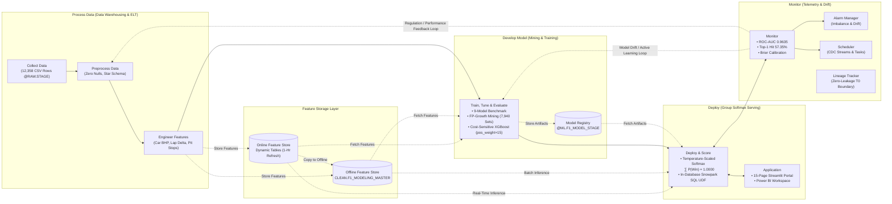

```mermaid
flowchart LR
    subgraph P1 ["Process Data (Data Warehousing & ELT)"]
        D1["Collect Data\n(12,358 CSV Rows @RAW.STAGE)"] --> D2["Preprocess Data\n(Zero Nulls, Star Schema)"]
        D2 --> D3["Engineer Features\n(Car BHP, Lap Delta, Pit Stops)"]
    end

    subgraph Stores ["Feature Storage Layer"]
        OnFS[("Online Feature Store\nDynamic Tables (1-Hr Refresh)")]
        OffFS[("Offline Feature Store\nCLEAN.F1_MODELING_MASTER")]
    end

    subgraph P2 ["Develop Model (Mining & Training)"]
        M1["Train, Tune & Evaluate\n• 9-Model Benchmark\n• FP-Growth Mining (7,940 Sets)\n• Cost-Sensitive XGBoost (pos_weight=15)"]
        Reg[("Model Registry\n@ML.F1_MODEL_STAGE")]
    end

    subgraph P3 ["Deploy (Group Softmax Serving)"]
        DEP["Deploy & Score\n• Temperature-Scaled Softmax\n  ∑ P(Win) = 1.0000\n• In-Database Snowpark SQL UDF"]
        APP["Application\n• 15-Page Streamlit Portal\n• Power BI Workspace"]
    end

    subgraph P4 ["Monitor (Telemetry & Drift)"]
        MON["Monitor\n• ROC-AUC 0.9635\n• Top-1 Hit 57.35%\n• Brier Calibration"]
        ALARM["Alarm Manager\n(Imbalance & Drift)"]
        SCHED["Scheduler\n(CDC Streams & Tasks)"]
        LIN["Lineage Tracker\n(Zero-Leakage T0 Boundary)"]
    end

    %% Connections
    D3 -.->|"Store Features"| OnFS
    D3 -.->|"Store Features"| OffFS
    OnFS -.->|"Copy to Offline"| OffFS
    OnFS -.->|"Fetch Features"| M1
    OffFS -.->|"Fetch Features"| M1
    D3 --> M1

    OnFS -.->|"Real-Time Inference"| DEP
    OffFS -.->|"Batch Inference"| DEP

    M1 --> DEP
    M1 -.->|"Store Artifacts"| Reg
    Reg -.->|"Fetch Artifacts"| DEP

    DEP <--> APP
    DEP <--> MON
    MON --> ALARM
    MON --> SCHED

    %% Feedback loops
    MON -.->|"Model Drift / Active Learning Loop"| M1
    MON -.->|"Regulation / Performance Feedback Loop"| D2
```
